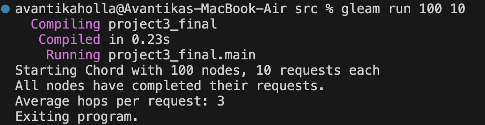
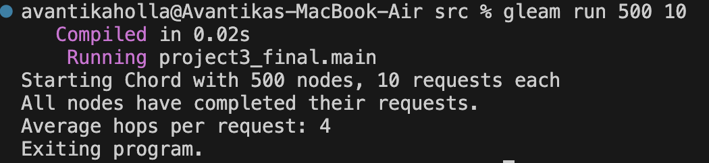
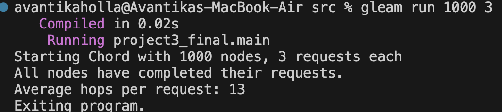

## Team members
Anushri Neramballi Raghavendra (UF ID: 38155612)

Avantika Holla Sathyanarayana (UF ID: 25363524)

## Program Structure
- The Chord network is initialized by creating a number of Chord nodes based on the user-specified num_nodes. Each node is assigned a unique identifier and connected in a circular ring by setting up appropriate successor relationships.
- Once the Chord structure is initialized, each node builds its finger table using the FixFingers procedure. After the initial setup, nodes may dynamically join the network using the Join operation, which adjusts successor pointers based on the FindSuccessor function.
- After stabilization, each node performs a series of key lookups, equal to num_requests (user input) to locate randomly chosen keys (from the range [0, 2^32 - 1]). Each lookup tracks the number of hops required to find the responsible node. Finally, the total hop counts from all lookup operations are collected to calculate the average number of hops per lookup, reflecting the overall efficiency of the Chord network.

## What is working
The Chord implementation works perfectly, gracefully handling node additions to the network and consistently giving a log(n) performance on node lookup. 

The following APIs were used to implement the Chord protocol and distribute the hashed key values across the network. The keys were successfully retrieved using the finger table. We tested it for different combinations of number of nodes and number of requests. It was observed that on an average log(number of nodes) performance was achieved for node lookup operations.

### **Chord Initialization**
- **Message**: Init
  - Assigns each node a unique identifier and establishes its successor links to form the Chord ring using InitChord.

### **Network Join**
- **Message**: Join
  - Handles the addition of new nodes to the existing Chord network dynamically.
- **Message**: FindSuccessor
  - Locates the correct successor for a joining node or a given key.
  - Ensures ring consistency by updating successor pointers using SetSuccessor.
- **Message**:FixFingers
  - Refreshes the finger table entries after a new node joins to minimize hops.

### **Finger Table Maintenance**
- **Message**: FixFingers
  - Iterates through each finger table entry to ensure correctness as the network evolves.
  - Helps maintain accurate routing information and consistent lookup performance.
- **Message**: SetFinger
  - Updates specific finger table entries with the appropriate node reference.
  - Ensures that finger tables remain accurate and reflective of the current Chord ring structure.

### **Simulation**
- **Message**: SendRequests
  - Each node performs multiple lookup operations based on the user-specified number (num_requests).
  - Coordinates and records hop counts for all lookups to evaluate network efficiency.
  - The average hop count is calculated based on the total hops from all requests sent by each node.

### **Lookup**
- **Message**: Search
  - Initiates lookup requests for randomly generated keys within the range [0, 2^32 - 1].
  - Tracks and records the number of hops taken to locate the node responsible for each key.
- **Function**: closest_preceding_node()
  - Searches the finger table to find the node that most closely precedes the target key.
  - Used to forward lookup requests efficiently, reducing lookup path length.

## Performance
- We ran the network for different combinations of number of nodes and number of requests, and we observed that, on average, node requests were being completed within O(log N) hops.

  Example:
  For 100 nodes and 10 requests, the average hop count = 3.
  

  For 500 nodes and 10 requests, the average hop count = 4
  

## The largest network successfully tested

The largest network successfully tested consisted of 1000 nodes.
  On average, each node performed 13 lookup requests, and the simulation handled them without issues.
  